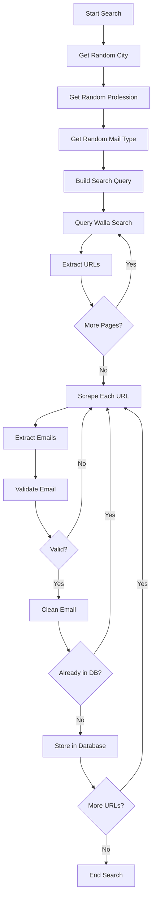

# Instructions

## Setup Instructions

1. Open the project in Visual Studio (2013 or later recommended)
2. Restore NuGet packages if needed
3. Set up the SQL Server database:
   - Create a new database
   - Run the database schema creation scripts
   - Create stored procedures (see Database Setup section)
4. Configure the connection string in `Web.config`
5. Build the solution (Ctrl+Shift+B)

## Configuration

### Database Connection

1. Open `Web.config`
2. Update the connection string with your SQL Server details:
   ```xml
   <connectionStrings>
     <add name="MainDB" 
          connectionString="Server=YOUR_SERVER;Database=CVSpider;User Id=YOUR_USER;Password=YOUR_PASSWORD;" 
          providerName="System.Data.SqlClient" />
   </connectionStrings>
   ```

### Email Configuration (if using SMTP)

Configure SMTP settings in `Web.config`:
```xml
<system.net>
  <mailSettings>
    <smtp from="your-email@example.com">
      <network host="smtp.example.com" 
               port="587" 
               userName="your-username" 
               password="your-password" 
               enableSsl="true" />
    </smtp>
  </mailSettings>
</system.net>
```

## Database Setup

### Required Tables

Create the following tables in your SQL Server database:

```sql
CREATE TABLE CVMails (
    asdws BIGINT PRIMARY KEY,
    Mail NVARCHAR(255) NOT NULL UNIQUE,
    Date DATETIME NOT NULL
);

CREATE TABLE LastID (
    LastID1 BIGINT NOT NULL
);

INSERT INTO LastID (LastID1) VALUES (0);
```

### Stored Procedures

Create stored procedures for:
- `GetBannersByLocationId1` - Retrieves banner data
- `UpdateBannerStats` - Updates banner statistics
- Other procedures as needed for your specific implementation

## Running the Application

### Web Interface

1. Set the project as startup project
2. Press F5 to run in debug mode
3. The web interface will open in your default browser

### Background Processing

The application uses `FetchMails.ashx` handler for background email fetching:
- Triggered programmatically or via scheduled task
- Can be called via HTTP: `http://localhost/FetchMails.ashx`

## Core Components

### FetchMails Handler

Main component responsible for:
1. Generating search queries (city + profession + email type in Hebrew)
2. Fetching search results from Walla search
3. Extracting URLs from search results
4. Scraping email addresses from found pages
5. Validating and cleaning emails
6. Storing unique emails in database

### Data Classes

- **Cities.cs**: Manages Hebrew city names for search queries
- **Professions.cs**: Manages Hebrew profession names
- **MailTypes.cs**: Manages email-related keywords
- **DAL.cs**: Data Access Layer for database operations
- **BLL.cs**: Business Logic Layer for application logic

## Search Process Flow



## Email Validation Rules

The application validates emails with:
- Proper @ symbol presence
- Minimum length requirements for local and domain parts
- Exclusion of image file extensions (.jpg, .png)
- Handling of malformed characters and encoding issues
- Format validation using .NET MailAddress class

## Email Cleaning Process

The `ClearEmail` method fixes common issues:
- Corrects domain misspellings (.co → .co.il, .com2 → .com)
- Removes special characters (%, |, ^, etc.)
- Handles mailto: links
- Fixes duplicate dots and malformed @ symbols
- Normalizes Hebrew email domains

## Customization

### Adding New Cities

Edit `Core/Cities.cs` and add new city names to the list:
```csharp
public static string GetRandomCity()
{
    string[] cities = { "תל אביב", "ירושלים", "חיפה", "YOUR_CITY" };
    // ...
}
```

### Adding New Professions

Edit `Core/Professions.cs` and add new professions:
```csharp
public static string GetRandomProfession()
{
    string[] professions = { "מתכנת", "מהנדס", "YOUR_PROFESSION" };
    // ...
}
```

### Modifying Search Sources

Currently uses Walla search. To add other sources:
1. Create new methods in `FetchMails.ashx.cs`
2. Implement URL extraction logic for the new source
3. Call from `SearchMails()` method

## Performance Considerations

- Implement rate limiting to avoid overwhelming target servers
- Use async/await patterns for better scalability
- Consider caching search results temporarily
- Add delays between requests to be respectful of server resources
- Monitor database growth and implement archiving strategy

## Security Considerations

- Never expose database connection strings in public repositories
- Validate all user inputs before database operations
- Use parameterized queries to prevent SQL injection
- Implement proper error handling without exposing sensitive details
- Consider encryption for stored email addresses (GDPR compliance)

## Legal and Ethical Notes

**WARNING**: Web scraping and email collection must comply with:
- Local and international laws (CAN-SPAM Act, GDPR, etc.)
- Website terms of service and robots.txt files
- Anti-spam regulations
- Privacy and data protection requirements

This project is provided for educational purposes. Users are responsible for ensuring their use complies with all applicable laws and regulations.

## Troubleshooting

### Connection Issues
- Verify SQL Server is running and accessible
- Check connection string format and credentials
- Ensure firewall allows SQL Server connections

### Email Validation Errors
- Check regex patterns for Hebrew character support
- Verify .NET Framework version supports required features
- Test with various email formats

### Scraping Failures
- Websites may change their HTML structure
- Update URL extraction patterns as needed
- Implement proper error logging for debugging

## Author

* **Or Assayag** - *Initial work* - [orassayag](https://github.com/orassayag)
* Or Assayag <orassayag@gmail.com>
* GitHub: https://github.com/orassayag
* StackOverflow: https://stackoverflow.com/users/4442606/or-assayag?tab=profile
* LinkedIn: https://linkedin.com/in/orassayag
