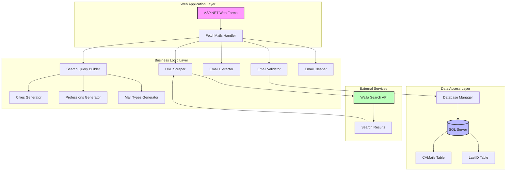
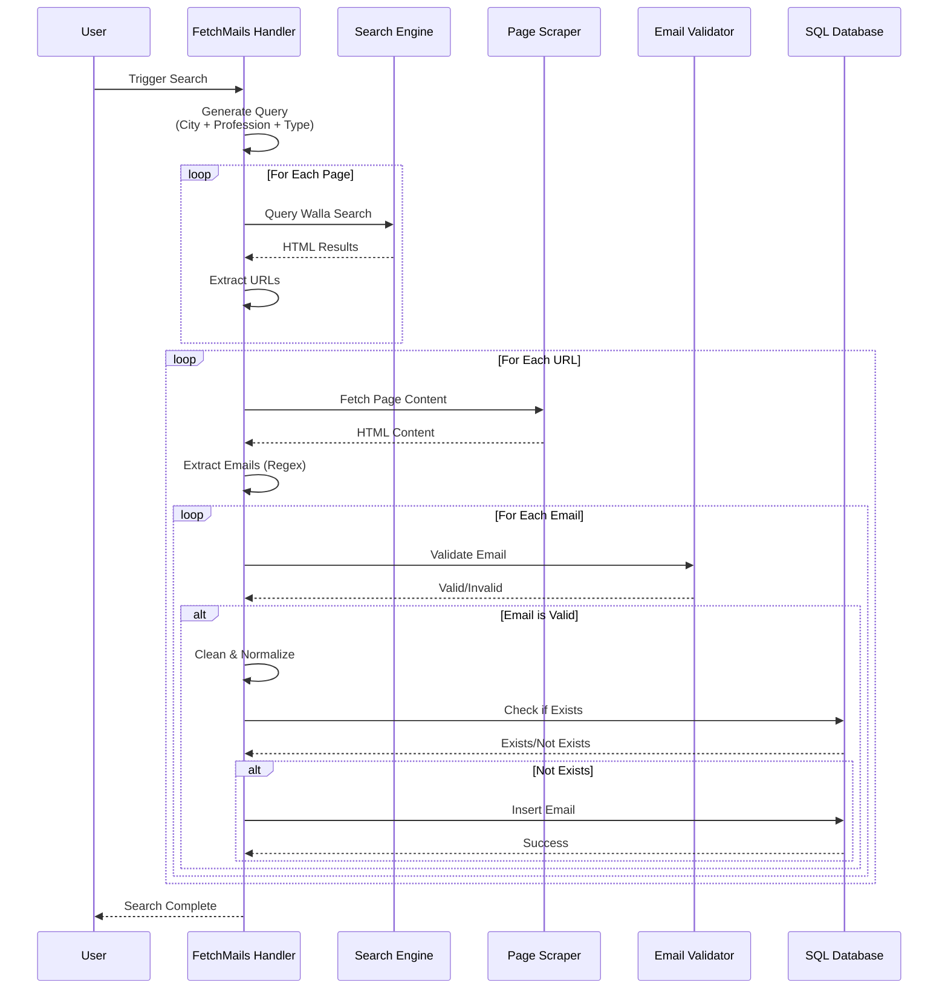

# CV Spider V3

An ASP.NET Web Forms application that automatically discovers and collects email addresses from search engine results for CV/resume sourcing purposes. The application scrapes search results, validates emails, and maintains a database of unique contacts.

Built in October 2014. Third version of CV spider that searches with Walla search engine (leveraging Google search), processes search results from multiple pages, extracts and validates email addresses, and stores them in a SQL Server database for further processing.

**⚠️ IMPORTANT NOTICE**: This project is provided for educational and research purposes only. Web scraping and automated email collection must comply with applicable laws including GDPR, CAN-SPAM Act, and website terms of service. Users are solely responsible for ensuring their use complies with all legal requirements.

## Features

- 🔍 Automated search query generation using Hebrew keywords (cities + professions)
- 🌐 Multi-page search result scraping from Walla search engine
- 📧 Email extraction using regex patterns
- ✅ Comprehensive email validation and cleaning
- 🗄️ SQL Server database storage with duplicate prevention
- 🔄 Concurrent processing with thread-safe operations
- 🧹 Smart email normalization (fixes common typos and malformed addresses)
- 🎲 Randomized search parameters to diversify results

## System Architecture



## Data Flow Diagram



## Getting Started

### Prerequisites

- Visual Studio 2013 or later
- .NET Framework 4.5 or higher
- SQL Server 2012 or later (Express edition is sufficient)
- IIS or IIS Express for hosting

### Installation

1. Clone the repository:
```bash
git clone https://github.com/orassayag/cv-spider-v3.git
cd cv-spider-v3
```

2. Open the solution in Visual Studio:
```
CVNew.sln
```

3. Restore NuGet packages (if any dependencies are added)

4. Set up the database:
```sql
-- Create database
CREATE DATABASE CVSpider;
GO

USE CVSpider;
GO

-- Create tables
CREATE TABLE CVMails (
    asdws BIGINT PRIMARY KEY,
    Mail NVARCHAR(255) NOT NULL UNIQUE,
    Date DATETIME NOT NULL
);

CREATE TABLE LastID (
    LastID1 BIGINT NOT NULL
);

INSERT INTO LastID (LastID1) VALUES (0);
```

5. Configure connection string in `Web.config`:
```xml
<connectionStrings>
  <add name="MainDB" 
       connectionString="Server=YOUR_SERVER;Database=CVSpider;User Id=YOUR_USER;Password=YOUR_PASSWORD;" 
       providerName="System.Data.SqlClient" />
</connectionStrings>
```

6. Build and run the project (F5)

## Project Structure

```
cv-spider-v3/
├── Core/
│   ├── BLL.cs              # Business Logic Layer
│   ├── DAL.cs              # Data Access Layer
│   ├── Cities.cs           # City names for search queries
│   ├── Professions.cs      # Profession keywords
│   └── MailTypes.cs        # Email-related search terms
├── Properties/
│   └── AssemblyInfo.cs     # Assembly metadata
├── FetchMails.ashx         # HTTP handler entry point
├── FetchMails.ashx.cs      # Main scraping and processing logic
├── Web.config              # Application configuration
├── CVNew.csproj            # Project file
├── CVNew.sln               # Solution file
└── README.md               # This file
```

## Configuration

### Web.config Settings

Key configuration sections:

```xml
<configuration>
  <connectionStrings>
    <!-- Database connection -->
    <add name="MainDB" connectionString="..." />
  </connectionStrings>
  
  <system.web>
    <compilation debug="true" targetFramework="4.5" />
    <httpRuntime targetFramework="4.5" />
  </system.web>
</configuration>
```

### Customizing Search Parameters

Edit the following files to customize search behavior:

- **Cities** (`Core/Cities.cs`): Add/modify Israeli cities for geographic targeting
- **Professions** (`Core/Professions.cs`): Add/modify job titles and professions
- **Mail Types** (`Core/MailTypes.cs`): Add/modify email-related keywords

## Usage

### Starting a Search

The application can be triggered in several ways:

1. **Programmatically**: Call `FetchMails.SearchMails()` from your code
2. **HTTP Request**: Access the handler directly via browser or HTTP client
3. **Scheduled Task**: Set up Windows Task Scheduler to call the handler URL

### Email Processing Flow

1. **Query Generation**: Combines random city + profession + mail type in Hebrew
2. **Search Execution**: Queries Walla search for multiple pages (10 pages per search)
3. **URL Extraction**: Parses HTML to find relevant page links
4. **Page Scraping**: Fetches content from each discovered URL
5. **Email Extraction**: Uses regex to find email patterns
6. **Validation**: Checks format, length, domain validity
7. **Cleaning**: Normalizes and fixes common typos/malformations
8. **Storage**: Saves unique emails to database with timestamp

## Database Schema

### CVMails Table

| Column | Type | Description |
|--------|------|-------------|
| asdws | BIGINT | Primary key, auto-incremented ID |
| Mail | NVARCHAR(255) | Email address (unique) |
| Date | DATETIME | Timestamp when email was discovered |

### LastID Table

| Column | Type | Description |
|--------|------|-------------|
| LastID1 | BIGINT | Last used ID for CVMails table |

## Email Validation & Cleaning

### Validation Rules

- Must contain `@` symbol
- Minimum length requirements for local and domain parts
- Excludes image extensions (.jpg, .png)
- Format validation using .NET `MailAddress` class
- Special character handling for Hebrew domains

### Common Fixes Applied

- `.co` → `.co.il`
- `.con` → `.com`
- `gmail.co` → `gmail.com`
- Removes: `/`, `\`, `%`, `|`, `^`, `!`, `?`
- Handles `mailto:` links
- Fixes double dots (`..`)
- Normalizes multiple spaces

## Performance & Best Practices

### Thread Safety

The application uses `lock` statements to ensure thread-safe database operations:

```csharp
lock (this)
{
    // Database insert operations
}
```

### Error Handling

Comprehensive try-catch blocks prevent crashes:
- Network request failures
- HTML parsing errors
- Database connection issues
- Invalid email formats

### Resource Management

- `WebClient` objects are properly disposed
- Database connections are closed after operations
- Large result sets are processed iteratively

## Legal & Ethical Considerations

### Compliance Requirements

This tool must be used in compliance with:

- **GDPR** (General Data Protection Regulation)
- **CAN-SPAM Act** (US anti-spam law)
- **CCPA** (California Consumer Privacy Act)
- Website terms of service and robots.txt files
- Local data protection and privacy laws

### Responsible Use Guidelines

1. **Respect Rate Limits**: Implement delays between requests
2. **Honor robots.txt**: Check and respect website crawling policies
3. **Obtain Consent**: Only contact people who have consented to communication
4. **Data Protection**: Encrypt stored emails, implement access controls
5. **Right to Erasure**: Provide mechanisms for data deletion requests
6. **Transparency**: Clearly communicate data collection and usage purposes

### Disclaimer

This software is provided "as is" for educational purposes. The author assumes no liability for misuse or legal violations. Users are solely responsible for ensuring their use complies with all applicable laws and regulations.

## Built With

* [ASP.NET Web Forms](https://www.asp.net/web-forms) - Web application framework
* [SQL Server](https://azure.microsoft.com/services/sql-database/) - Database engine
* [Stored Procedures](https://docs.microsoft.com/sql/relational-databases/stored-procedures/) - Database logic component
* [.NET Framework](https://dotnet.microsoft.com/download/dotnet-framework) - Runtime environment
* [Regular Expressions](https://docs.microsoft.com/dotnet/standard/base-types/regular-expressions) - Pattern matching for email extraction

## Contributing

Contributions to this project are [released](https://help.github.com/articles/github-terms-of-service/#6-contributions-under-repository-license) to the public under the [project's open source license](LICENSE).

Everyone is welcome to contribute. Contributing doesn't just mean submitting pull requests—there are many different ways to get involved, including answering questions and reporting issues.

Please read [CONTRIBUTING.md](CONTRIBUTING.md) for details on our code of conduct and the process for submitting pull requests.

## Versioning

We use [SemVer](http://semver.org) for versioning. For the versions available, see the [tags on this repository](https://github.com/orassayag/cv-spider-v3/tags).

## Author

* **Or Assayag** - *Initial work* - [orassayag](https://github.com/orassayag)
* Or Assayag <orassayag@gmail.com>
* GitHub: https://github.com/orassayag
* StackOverflow: https://stackoverflow.com/users/4442606/or-assayag?tab=profile
* LinkedIn: https://linkedin.com/in/orassayag

## License

This application is licensed under the MIT License - see the [LICENSE](LICENSE) file for details.

## Acknowledgments

- Built as part of a learning project to understand web scraping and data collection
- Inspired by recruitment automation needs
- Hebrew language processing and domain handling
